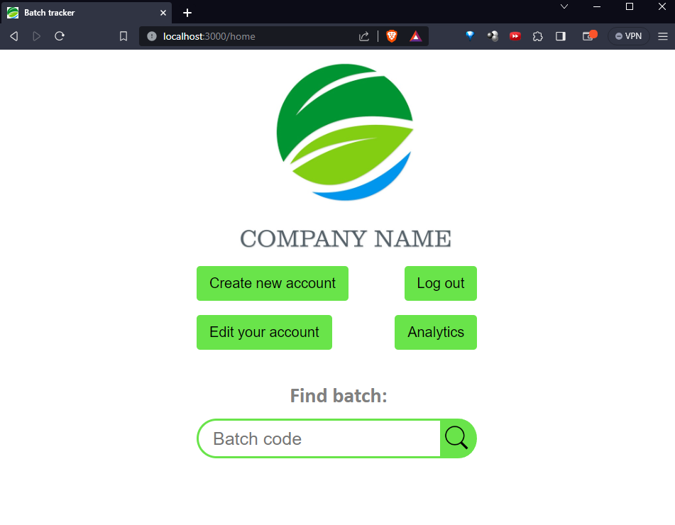
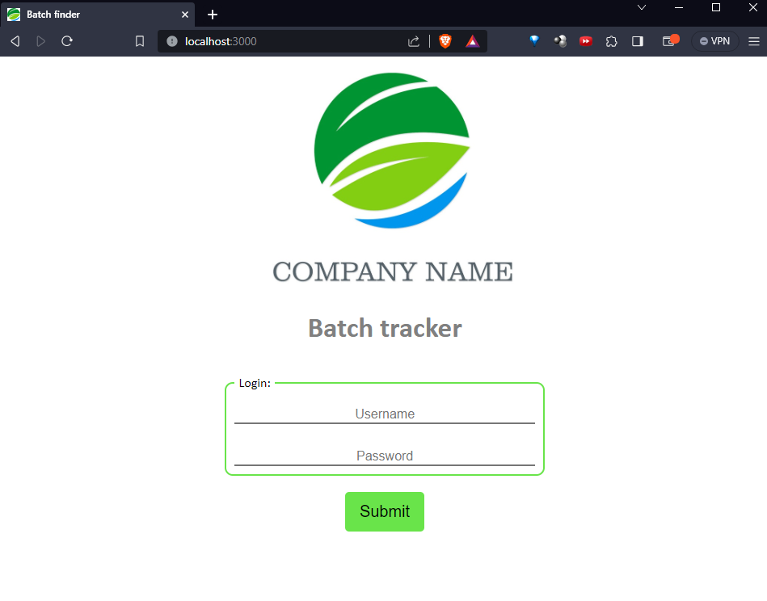
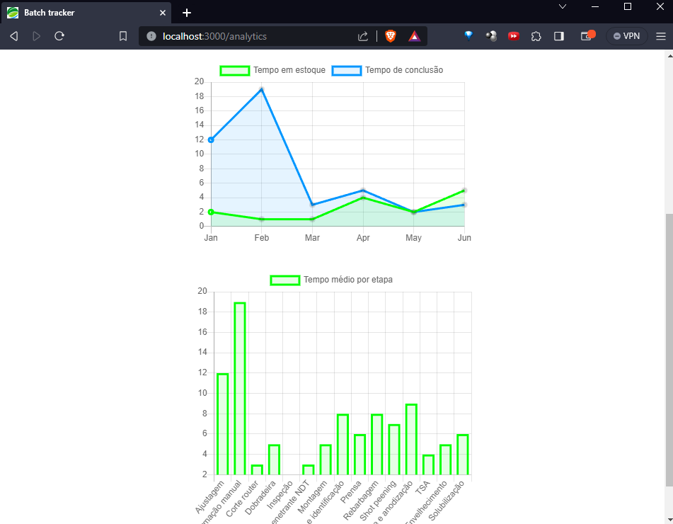
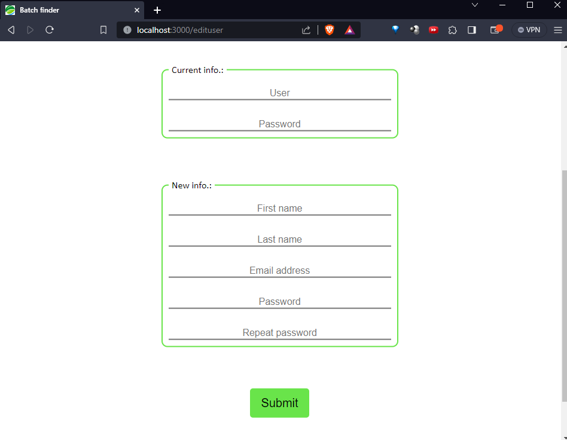
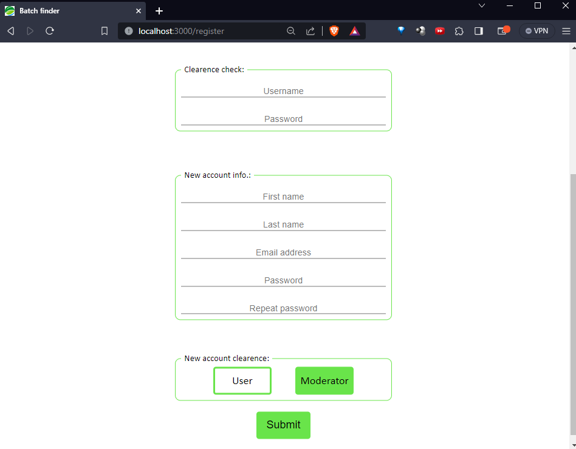
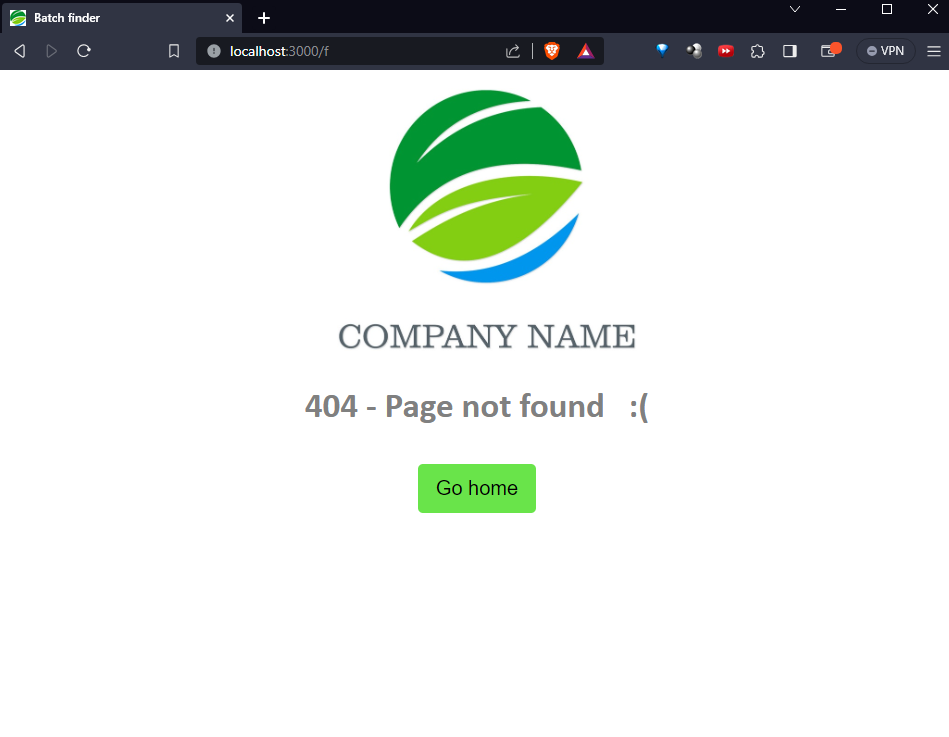

# batch-tracker
This is the MVP of an archived project that aimed to track the performance of the production line of a company. The project would consist of RFID gates that would track the batches statistics (eg. time to completion and  workers involved) and then serve the data to a web server which would serve a dashboard and configuration page.

This part of the project is composed of a Node.JS server and PostgreSQL as database to store all the events involving the production steps, times, locations and users. To use the interface it is required to be authenticated and then a session would be created to maintain the user logged in temporarily. All sensitive data, like emails and passwords, are hashed with bcrypt.

This repository only contains the web side of the project. When I have more time I'll create another repository with the RFID stuff.

# login
<!-- {width=50 height=50} -->
<!-- {width=500px}
{width=50} -->
<!-- {width=50%} -->

<!--  -->
<!--  -->

# home

# dashboard

# edit user

# new user

# 404
